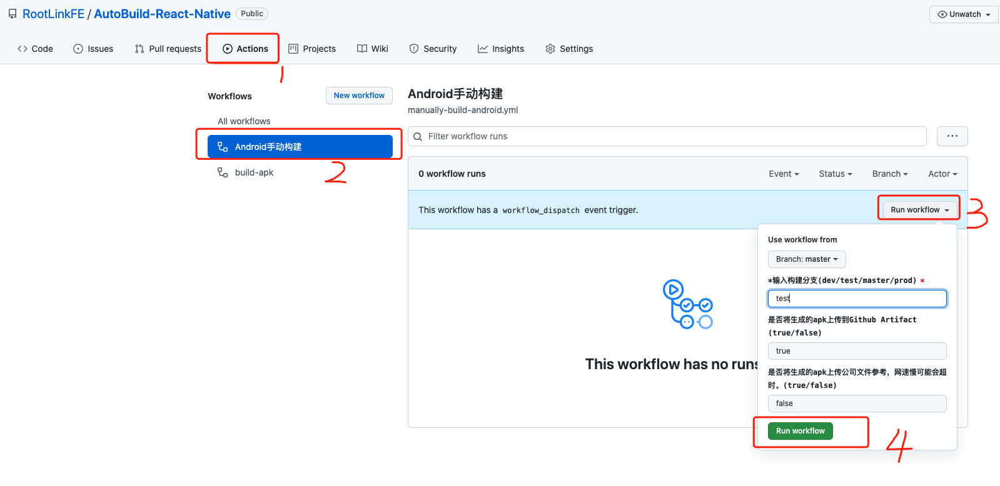

# devops-crm-app

利用 Action 构建私库 gitlab rn app 代码

- 支持 Android
- 支持 IOS

实现总结文章：[GitHub Actions 实现 RN App 自动化构建并推送到蒲公英](https://github.com/giscafer/blog/issues/53)

## 使用说明

<!-- 利用 git message 提交信息区分构建不同环境分支代码

建议修改文件 `CHANGELOG.md` ，内容随便写，日记信息按下边要求提交即可（如果有过构建记录，点击`Action`栏，重新执行就可以免去这些步骤）。

git message 关键词区分说明：

- 不写关键词或关键词：`dev` 时，构建 `dev` 分支
- 关键词：`test` 时，构建 `test` 分支
- 关键词：`master` 时，构建 `master` 分支
- 关键词：`prod` 时，构建 `prod` 分支
- 关键词：`[skip ci]` 时，不会触发 Action 流程

构建成功后，项目消息推送群会信息，失败也会有消息推送

**如果觉得麻烦，也支持手动选择构建**，如下： -->

> 自动触发构建已关闭，仅留手动入口

### 手动构建说明

- Android 手动构建入口

手动触发 Android 构建流程步骤（IOS 同理）：

## 其他

- Github Action 官方文档：https://docs.github.com/en/actions/learn-github-actions
- IOS 接入 GitHub Action
  - https://github.com/yukiarrr/ios-build-action
  - https://www.jianshu.com/p/d5ebf33145b9
