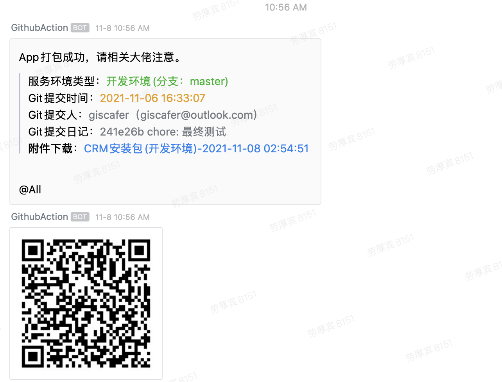

# AutoBuild-React-Native

利用 Action 构建私库 gitlab rn app 代码

## 使用说明

利用 git message 提交信息区分构建不同环境分支代码

建议修改文件 `CHANGELOG.md` ，内容随便写，日记信息按下边要求提交即可（如果有过构建记录，点击`Action`栏，重新执行就可以免去这些步骤）。

git message 关键词区分说明：

- 不写关键词或关键词：`dev` 时，构建 `dev` 分支
- 关键词：`test` 时，构建 `test` 分支
- 关键词：`master` 时，构建 `master` 分支
- 关键词：`prod` 时，构建 `prod` 分支
- 关键词：`[skip ci]` 时，不会触发 Action 流程

构建成功后，项目消息推送群会有如下信息：

> 失败也会有消息推送

## 其他

Github Action 学习文档：https://docs.github.com/en/actions/learn-github-actions
